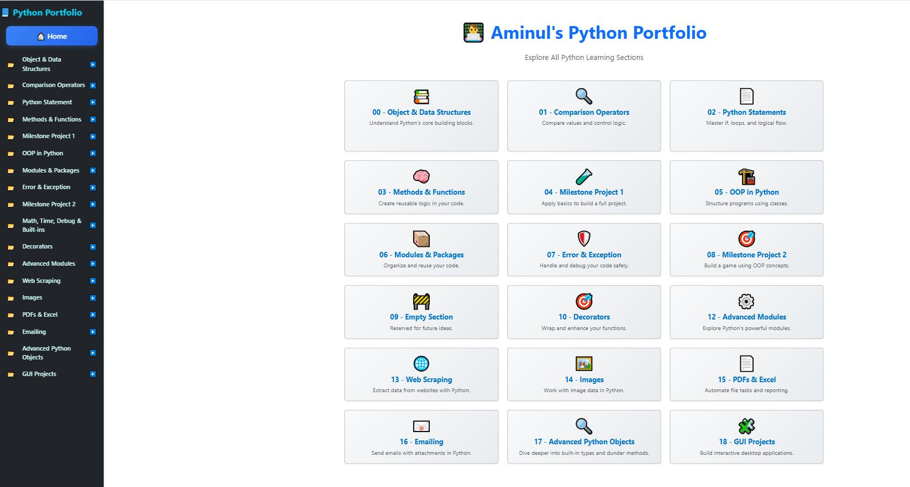

# 🐍 Aminul's Python Portfolio


A comprehensive Python learning portfolio structured into hands-on sections. This interactive platform allows learners and developers to explore Python fundamentals, object-oriented programming, error handling, automation, web scraping, GUI projects, and more — all organized in a clean sidebar and dashboard interface.



---

## 📌 Project Purpose

To create a structured, modular, and visually appealing platform for learning and demonstrating Python skills across various domains including data handling, automation, GUI apps, and backend logic. It also serves as a professional showcase for job applications or mentoring opportunities.

---

## 🌟 Key Features

- 📁 Sidebar-based navigation for all major Python topics
- 🧠 Object & Data Structures, Control Flow, Functions, OOP
- 🧪 Real-world exercises and milestone projects
- 🛠 Error Handling, Debugging, Decorators, and Advanced Modules
- 🌐 Web Scraping and API interaction examples
- 🖼 Image and file processing (PDF, Excel)
- 📧 Sending emails with Python (attachments, HTML)
- 🖥 GUI Projects for desktop interaction
- ✅ Dynamic quiz functionality to reinforce learning
- 🎨 Clean responsive UI built with Bootstrap + custom styles

---

## 🛠️ Tech Stack

- Python 3.x
- HTML5 + CSS3
- Bootstrap 5
- JavaScript (quiz engine)
- Django (for web integration, optional)
- Git + GitHub

---

## 🚀 How to Run Locally

### 1. Clone this repo:

```bash
git clone https://github.com/aminul-portfolio/latest_python_portfolio.git
cd latest_python_portfolio
```

### 2. Create and activate virtualenv:

```bash
python -m venv env
# Windows:
env\Scripts\activate
# macOS/Linux:
source env/bin/activate
```

### 3. Install dependencies:

```bash
pip install -r requirements.txt
```

### 4. Run project (if using Django):

```bash
python manage.py runserver
```

---

## 🖼 Screenshot

Save the screenshot in:

```
images/python_portfolio.JPG
```

The README references this file for visual documentation.

---

## 🎯 Learning Objectives

- Master Python in an organized, practical environment
- Apply real-world projects with Python logic
- Build reusable quiz-enhanced learning modules
- Reinforce concepts through interactive examples
- Prepare for jobs, freelancing, or further specialization

---

## 📄 License

This project is licensed under the [MIT License](LICENSE).

---

## 🙋‍♂️ Author

**Aminul Islam (Sumon)**  
🔗 [GitHub: aminul-portfolio](https://github.com/aminul-portfolio)  
💼 Python Developer | Aspiring Data Analyst | Django Full-Stack Enthusiast
